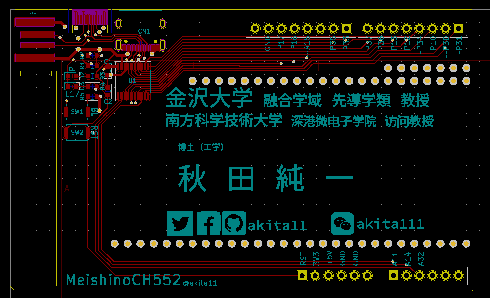

# MeishinoCH552

つくった基板を名刺代わりに！

基板の表や裏の空いているところに、自分の名前などをシルクで入れれば、オリジナル基板のできあがり。
あとは製造発注して、名刺代わりに配りましょう。

## マイコンボードとしての使い方

基板製造時に部品実装(PCBA)もいっしょに注文すれば、ArduinoIDEでプログラムを書けるマイコンボードとしても使えます。もちろん自分で部品をはんだ付けしてもOK。
（[CH552duino](https://github.com/akita11/CH552duino)と同じ構成ですので、これの使い方を参照してください）

PCにつなぐUSB端子は、以下の3つのいずれかを使えます。

- 基板の一部にあるUSB端子を直接PCへ（USB端子の周りの板を切り取って使います。（※板厚2.0mm。それより薄い場合は厚紙などをはさむ）
- 基板上部にあるUSB Type-C端子にUSB Type-Cケーブルで接続（※板厚0.6mm）
- 基板上にUSB Type-Cコネクタを実装し、USB Type-Cケーブルで接続

## オリジナル基板のつくりから

プリント基板設計CADの[KiCAD](https://www.kicad.org/)で名前などを記入し、オリジナル基板をつくることができます。
文字だけでなく、画像を入れることもできます。名前などが書かれた画像データを用意します。例してPowerPointファイル(namecard.pptx)を用意してあります。この枠内をスクリーンショットで保存するのが簡単でいいでしょう。

画像データはKiCADの"Bitmap Converter"で、KiCADで使える部品（フットプリント）に変換してから、基板に読み込んで配置すればOKです。例として、名前などを入れたもの（MeishinoCH552_sample.kicad_pcb）を用意してありますので参考にしてください。

# 基板の製造

製造用ガーバーデータ（MeishinoCH552_gerber.zip：ただし名前などは何も入っていない）を使うか、[KiCAD](https://www.kicad.org/)で設計したものから製造用ガーバーデータを出力します。

基板製造は、[JLCPCB](https://jlcpcb.com/)などのオンラインサービスを使うと便利です。

基板の色（レジスト）は自由です。基板上部のUSB Type-C端子を使うためには、板厚は0.6mmとしてください（これを使わない場合は板厚は自由）。

# 部品の調達と実装

部品表（MeishinoCH552_BOM_JLCSMT.xlsx）の部品を[LCSC](https://lcsc.com/)などで購入し、手ハンダなどの方法で部品を実装します。あるいは、この部品表を部品位置ファイル（MeishinoCH552_CPL_JLCSMT.xlsx）とともに[JLCPCB](https://jlcpcb.com/)に注文すれば、部品実装が済んだ状態のものを得ることもできます。

# Author

Junichi Akita (@akita11, akita@ifdl.jp)